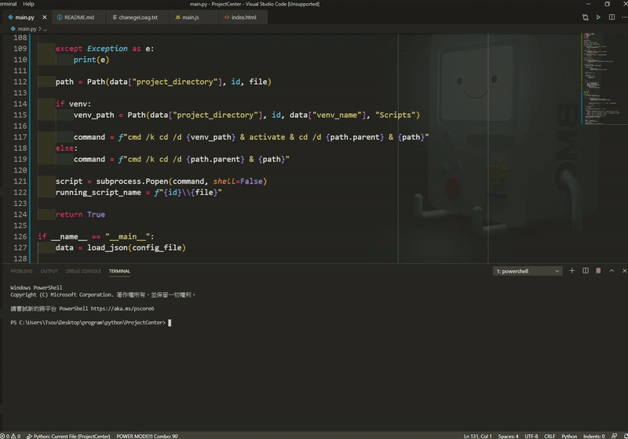
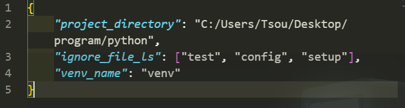

執行自己的程式時，基本上都是用VSC或是CMD，而使用CMD時要嘛就手動執行虛擬環境後執行程式，不然就是寫個bat檔接著執行，隨著程式的數量越來越多，桌面一堆bat檔看了也覺得亂，所以想說不如直接寫一隻程式，我只要按下按鈕就可以直接執行某一隻程式。

目前程式應該是只能在Windows的環境下執行，執行程式後讀取所有根目錄中的專案資料夾，接著讀取每個專案內根目錄中的`.py`檔案。

判斷該專案中是否有使用虛擬環境(虛擬環境的資料夾必須放在專案根目錄中)，若有虛擬環境就開啟後執行程式，若無則使用當前環境執行程式(比較奇怪的是，我用VSC執行會使用原本安裝的python，但使用CMD執行的話會使用這個專案的虛擬環境，目前我不知道原因)。

接著只要點擊你想要執行的檔案就好了，程式執行的時候該按鈕會呈現紅色，再點擊一下就可以關閉，一次只能執行一隻程式。

設定檔的部份，目前必須打開json修改。
`project_directory`: 程式專案的根目錄。
`ingore_file_ls`: 輸入要排除的`.py`檔案名稱。
`venv_name`: 虛擬環境的資料夾名稱，若沒有的話就不需要做更動。

